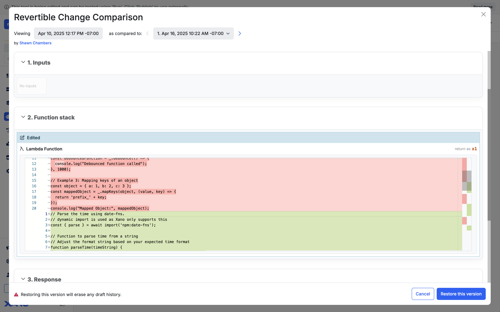

---
---
icon: recycle
---

# 'Building with Visual Development'



## The Anatomy of the Visual Builder

The builder will be comprised of **up to** three different sections — **inputs**, the **function stack**, and the **response**. Different function stack types may not contain all of the available sections listed below.

<figure><figcaption></figcaption></figure>







***

## What can I build?

### APIs

An API is a piece of logic or a workflow that can be called to run from external sources. Think about when you tap a button or link anywhere in an application; there are API calls happening behind the scenes to make sure those taps perform the expected action.

[[ ](./#apis)📖 [[**Learn more about APIs**](apis/)

### Custom Functions

A custom function is similar to an API, but it is reusable logic that you can insert into any other function stack. These are useful if you are implementing similar logic in multiple places, and allows you to build and maintain that logic in a single location.

[[ ](./#custom-functions)📖 [[**Learn more about custom functions**](../functions/custom-functions.mdx)

### Background Tasks

A background task is a workflow that runs automatically based on a schedule that you define.

[[ ](./#background-tasks)📖 [[**Learn more about background tasks**](background-tasks.mdx)

### Triggers

A trigger is a workflow that runs every time something else happens. Xano supports two different kinds of triggers: **database triggers** and **realtime triggers**. Database triggers run every time a certain change is made in a database table, and realtime triggers run based on events in a realtime channel.

[[ ](./#triggers)📖 [[**Learn more about triggers**](triggers.mdx)

### Middleware

Think of middleware as an extra security guard at the entrance and exit of your other function stacks. You can build and deploy middleware to run either before a function stack, or right before it delivers a response. This is useful for things like input or output sanitization, custom error logging, security, and more.

[[ ](./#middleware)📖 [[**Learn more about middleware**](middleware.mdx)

***

## Using the Visual Builder

You can use both mouse and keyboard navigation when working in the builder.&#x20;



### Adding Functions

Click to add functions to your function stack. You can search for, choose, and favorite functions in the panel that appears on the right.

You can also hover over an existing function and click the **+** sign to add a new function directly under it.

<Success>

## Not sure where to start?

Xano can [[auto-generate basic endpoints](apis/#auto-generated-apis) for you based on your tables.

</Success>

### Creating a Draft

Once you start editing your API, a draft will automatically be created. Drafts keep track of each micro-change you (or your [[team members](broken-reference)) make to a Function Stack called Revertible Changes, which you can easily roll back.

### Revertible Changes

Revertible changes show each micro-change, when they were made, what the change was, and who made it.&#x20;

<figure><figcaption></figcaption></figure>

To revert a change, select the change you wish to revert back to. You can also revert all changes to revert all changes in the draft and return to the original version of the Function Stack.&#x20;

<figure><figcaption></figcaption></figure>

### Compare Differences

Before reverting a change, you are able to see a difference comparison snapshot of the previous draft version. This provides context in the differences of the previous version compared to the current draft you are on.

<figure><figcaption><p>Comparing differences of a previous version to the current draft.</p></figcaption></figure>

Comparing versions in function stacks using [[lambda-functions.md](../functions/apis-and-lambdas/lambda-functions.md "mention") or [[template-engine.md](../../xano-ai/template-engine.md "mention") will show your specific code changes in a specialized format for easy readability.

<figure><figcaption></figcaption></figure>

Once you're ready to revert, select **Restore this version**.

### Testing a Draft

Testing the API with Run & Debug will use the draft you are editing while calling the API from the front-end will use the live (published version) of the API.

If you have other drafts across your workspace that may interact with the current API or Function Stack you are editing, you can include the relevant drafts while testing in Run & Debug.

<figure><figcaption><p>Optionally include relevant drafts during Run &#x26; Debug.</p></figcaption></figure>

## Publishing

Once you're ready to publish the changes, you can simply select publish.\


<figure><figcaption></figcaption></figure>

You can include a description of the changes you are publishing. Additionally, you have the option to publish other active drafts in your workspace. This might be useful if you are working with multiple workspace objects that interact or depend on one another and need to be certain everything works harmoniously before publishing.&#x20;

<figure><figcaption><p>Optionally include a description of the published changes. Also, you may publish other drafts in the workspace at the same time. </p></figcaption></figure>

Once a draft is published, the changes will become live. Meaning if the API endpoint is called from a front-end, the changes will be reflected. Publishing a draft will create a new version of the API Endpoint, which allows you to roll back to previously published versions.&#x20;

**How do I know if I have drafts to publish?**

You can see drafts available for testing and publish via the Publish dialog on any of your function stacks, or in a notification on the dashboard. If you find that you have made changes but are not seeing the expected results via your front-end, ensure that you have published these changes.

***

## Working with Data

### Filters

Filters are additional functions that can be applied directly to other pieces of data in Xano. For example, a filter could be used for a mathematical operation, adjust text formatting, create new datasets from existing data, and more.

To apply a filter, just hover over a value box and click **Add Filter.**

<div align="left"><figure><figcaption></figcaption></figure></div>

To learn more about the available filters in Xano, head to the Filters section [[here](../filters/).

### Dot Notation

Dot Notation is used to navigate inside of variables and target specific pieces of data.

Let's use the following object as an example. This object is contained in a variable called <mark style="color:orange;">**author**</mark>.

```json
{
    id: 2,
    created_at: 1736364473744,
    name: "john Smith",
    genre: "Western"
}
```

Notice how the name field is not capitalized properly. When we edit this variable, we can use **dot notation** to target that name field specifically, like this:

```
author.name
```

This will tell Xano to keep the rest of the object the same, and only update the `name` field with whatever our adjustments are.

### Auto-Complete / Subpath



Xano keeps an understanding of the contents inside of your variables, which makes targeting data inside them easy.

In this example, we have a customer variable that contains data from our database. If you want to target a specific piece of information inside of that variable, such as the customer's email or name, you can click "x properties" next to the variable name.

<figure><figcaption></figcaption></figure>

Once you do that, you'll be able to select the data you're looking for.

<div align="left"><figure><figcaption></figcaption></figure></div>

***

## Copy and Paste

You can copy and paste function stacks in Xano, enabling speedy development across environments.

Copy and paste works inside of your own function stacks, as well as copying and pasting between workspaces and instances.

<Success>

**Hint**

If you need to reuse logic in more than one place, it is recommended to utilize [[Custom Functions.](../functions/custom-functions.mdx)

</Success>

### Selecting Functions

You can hold **Shift** and click on individual functions to select them.

<figure><figcaption></figcaption></figure>

Alternatively, you can also hold **Shift** and click + drag to select multiple functions.

<figure><figcaption></figcaption></figure>

Click your desired option  or use keyboard shortcuts for your operating system of choice. **Crtl+C / Crtl+X** on Windows, or **Cmd+C / Cmd+X** on Mac.

When you're ready to paste, you can do so with the same standard keyboard shortcut: **Crtl+V / Cmd+V**.

***

## Keyboard Navigation

| Section             | Key            | Action                                                                  |
| ------------------- | -------------- | ----------------------------------------------------------------------- |
| Function Stack      | ↑ ↓            | Navigate Function Stack rows inputs and response values                 |
| Function Stack      | Shift ↑ ↓      | Select multiple rows                                                    |
| Function Stack      | A              | Add row below highlighted row or inside highlighted empty row           |
| Function Stack      | Delete         | Delete highlighted row or selection of rows                             |
| Function Stack      | Enter          | Edit the highlighted row                                                |
| Function Stack      | D              | Edit the description of highlighted row                                 |
| Function Stack      | Cmd/Ctrl C     | Copy the highlighted row or selection                                   |
| Function Stack      | Cmd/Ctrl X     | Cut the highlighted row or selection                                    |
| Function Stack      | Cmd/Ctrl V     | Paste function stack clipboard contents below currently highlighted row |
| Function Stack      | Cmd/Ctrl Z     | Undo last change                                                        |
| Function Stack      | Cmd/Ctrl /     | Disable/enable highlighted row                                          |
| Function Stack      | F              | Convert a selection of rows into a function                             |
| Function Stack      | G              | Group a selection of rows                                               |
| Function Stack      | C              | Clone highlighted row                                                   |
| Function Stack      | Option/Alt ↑ ↓ | Move highlighted row                                                    |
| Inputs and Response | Enter          | Edit highlighted input/response                                         |
| Inputs and Response | Delete         | Delete highlighted input/response                                       |
| Inputs and Response | C              | Clone highlighted response                                              |
| Page Actions        | Cmd/Ctrl Z     | Undo last action                                                        |
| Page Actions        | Cmd/Ctrl Enter | Open the Run & Debug panel                                              |
| Page Actions        | Cmd/Ctrl P     | Open the Publish panel\`;                                               |