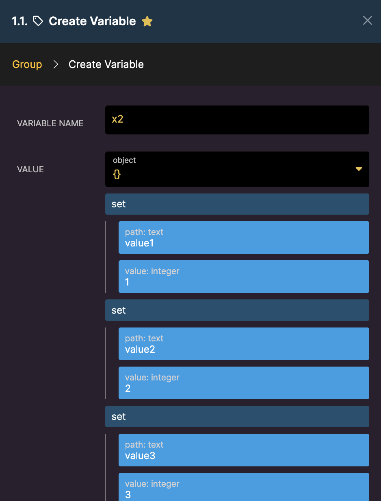
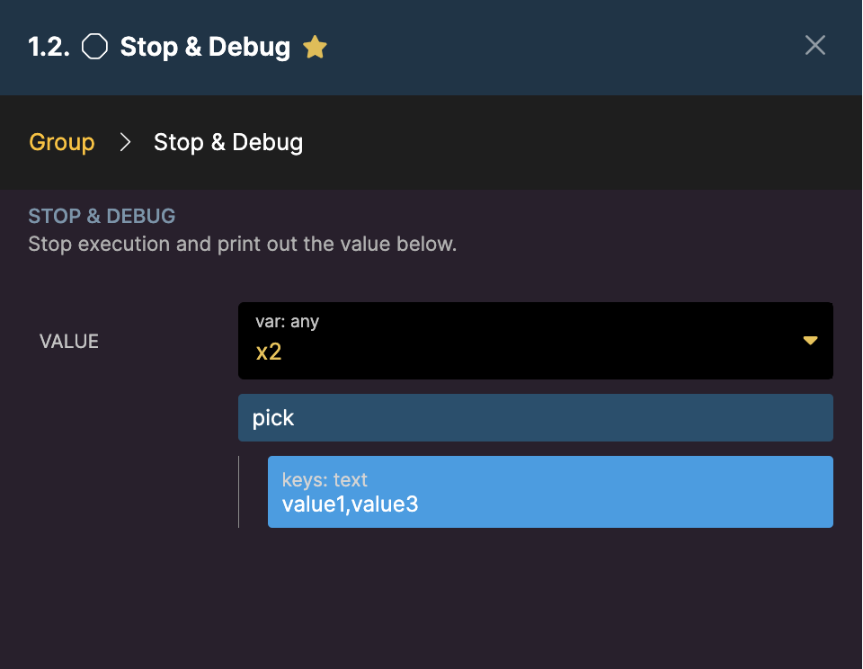
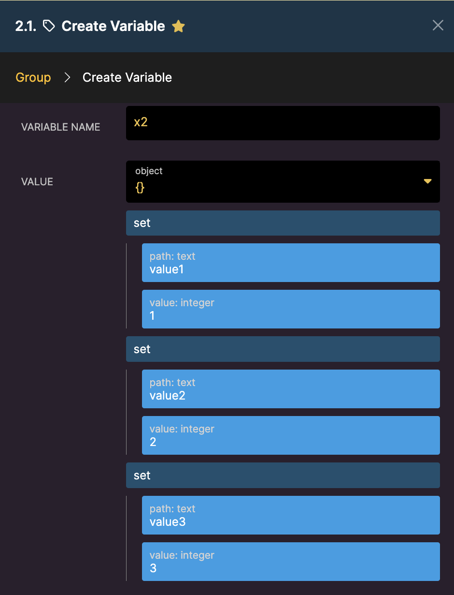
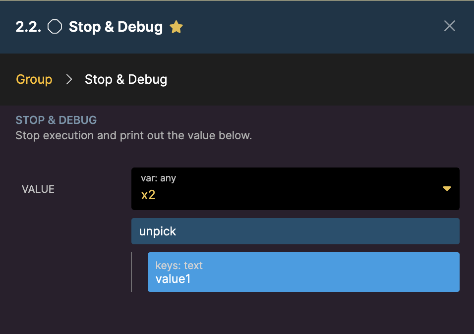

# 'Array'

* [[**append**](array.md#append) **-** Push an element on to the end of an array within an object and return the updated object
* [[**count**](array.md#count) **-** Return the number of items of an array
* [[**diff**](array.md#diff-diff_assoc) **-** Return values from the first array not present in the second. Only values are used for matching.
* [[**diff\_assoc**](array.md#diff-diff_assoc) **-** Return values from the first array not present in the second. Keys and values are used for matching.
* [[**filter\_empty**](array.md#filter_empty) **-** Returns a new array with only entries that are not empty ("", null, 0, \[])
* [[**first**](array.md#first) **-** Returns the first item of an array
* [[**flatten**](array.md#flatten) **-** Flattens a multi-dimensional array
* [[**intersect**](array.md#intersect-intersect_assoc) **-** Return values from the first array that are present in the second. Only values are used for matching.
* [[**interesct\_assoc**](array.md#intersect-intersect_assoc) **-** Return values from the first array that are present in the second. Keys and values are used for matching.
* [[**join**](array.md#join) **-** Joins an array into a text string via the separator and returns the result
* [[**last**](array.md#last) **-** Returns the last item of an array
* [[**merge**](array.md#merge) **-** Merges two arrays
* [[**merge\_recursive**](array.md#merge_recursive) **-** Merge all levels of both arrays
* [[**pop**](array.md#pop) **-** Pops the last element of an array off and returns it
* [[**prepend**](array.md#prepend) **-** Prepend an element on to the beginning of an array
* [[**push**](array.md#push) **-** Push an element on to the end of an array
* [[**range**](array.md#range) **-** Returns array of values between the specified start/stop
* [[**remove**](array.md#remove) **-** Remove any elements from the array that match the supplied value and return the new array
* [[**safe\_array**](array.md#safe_array) **-** Always return an array from the specified value
* [[**shift**](array.md#shift) **-** Shifts the first element off the Array and returns it
* [[**shuffle**](array.md#shuffle) **-** Returns the array in a randomized order
* [[**slice**](array.md#slice) **-** Extracts a specific section of an array
* [[**sort**](array.md#sort) **-** Sorts an array
* [[**unique**](array.md#unique) **-** Returns the array with duplicate values removed
* [[**unshift**](array.md#unshift) **-** Push an element to the beginning of an Array and return the new array
* [[**pick**](array.md#pick-unpick) **-** Pick keys from the object to create a new object of just those keys.
* [[**unpick**](array.md#pick-unpick) **-** Remove keys from the object to create a new object of the remaining keys.

### append

Push an element on to the end of an Array within an object and return the updated object.

<figure><figcaption></figcaption></figure>

***

### count

Return the number of items of an Array.

<figure><figcaption></figcaption></figure>

***

### diff / diff\_assoc

These filters will return values in the first array that are not present in the second array.

* **diff** will only use values for matching
*   **diff\_assoc** will use keys and values for matching\


    <figure><figcaption></figcaption></figure>

***

### filter\_empty

Returns a new Array with only entries that are not empty ("", null, 0, \[]). Use the **path** option if you want to search inside of objects.

<figure><figcaption></figcaption></figure>

***

### first

Get the first entry of an Array.

<figure><figcaption></figcaption></figure>

***

### filter\_empty\_array

### filter\_empty\_object

### filter\_empty\_text

### filter\_false

### filter\_null

### filter\_zero

These filters are designed to remove the corresponding values from an object or an array. Useful in scenarios where something is calling your APIs that you don't have full control over, such as a frontend platform.

| Parameter    | Purpose                       |
| ------------ | ----------------------------- |
| parent value | The array or object to target |

### Examples

| Example                                                                                                                                                                                                                    | Output                                                                                                                                                                                                                          |
| -------------------------------------------------------------------------------------------------------------------------------------------------------------------------------------------------------------------------- | ------------------------------------------------------------------------------------------------------------------------------------------------------------------------------------------------------------------------------- |
| <p></p><pre class="language-json"><code class="lang-json"><strong>{
</strong>        "title": "",
        "name": false,
        "width": 0,
        "items": [],
        "data": {},
        "info": null
}
</code></pre> | <p><strong>filter_empty_array</strong></p><pre class="language-json"><code class="lang-json">       {
         "title": "",
        "name": false,
        "width": 0,
        "data": {},
        "info": null
}
</code></pre> |
| <pre class="language-json"><code class="lang-json"><strong>{
</strong>        "title": "",
        "name": false,
        "width": 0,
        "items": [],
        "data": {},
        "info": null
}
</code></pre>        | <p><strong>filter_empty_object</strong></p><pre class="language-json"><code class="lang-json">{
        "title": "",
        "name": false,
        "width": 0,
        "items": [],
        "info": null
}
</code></pre>       |
| <pre class="language-json"><code class="lang-json"><strong>{
</strong>        "title": "",
        "name": false,
        "width": 0,
        "items": [],
        "data": {},
        "info": null
}
</code></pre>        | <p><strong>filter_empty_text</strong></p><pre class="language-json"><code class="lang-json">{
        "name": false,
        "width": 0,
        "items": [],
        "data": {},
        "info": null
}
</code></pre>          |
| <pre class="language-json"><code class="lang-json"><strong>{
</strong>        "title": "",
        "name": false,
        "width": 0,
        "items": [],
        "data": {},
        "info": null
}
</code></pre>        | <p><strong>filter_false</strong></p><pre class="language-json"><code class="lang-json">{
        "title": "",
        "width": 0,
        "items": [],
        "data": {},
        "info": null
}
</code></pre>                 |
| <pre class="language-json"><code class="lang-json"><strong>{
</strong>        "title": "",
        "name": false,
        "width": 0,
        "items": [],
        "data": {},
        "info": null
}
</code></pre>        | <p><strong>filter_null</strong></p><pre class="language-json"><code class="lang-json">{
        "title": "",
        "name": false,
        "width": 0,
        "items": [],
        "data": {}
}
</code></pre>                 |
| <pre class="language-json"><code class="lang-json"><strong>{
</strong>        "title": "",
        "name": false,
        "width": 0,
        "items": [],
        "data": {},
        "info": null
}
</code></pre>        | <p><strong>filter_zero</strong></p><pre class="language-json"><code class="lang-json">{
        "title": "",
        "name": false,
        "items": [],
        "data": {},
        "info": null
}
</code></pre>               |

***


### flatten

Flattens a multi-level array into a single-level array.

<figure><figcaption></figcaption></figure>

***

### intersect / intersect\_assoc

Returns the entries from the first array that are present in the second array.

* **intersect** will use values for matching
* **intersect\_assoc** will use keys and values for matching

<figure><figcaption></figcaption></figure>

***

### join

Joins an array into a text string via the separator and returns the result

<figure><figcaption></figcaption></figure>

***

### last

Get the last entry of an Array.

<figure><figcaption></figcaption></figure>

***

### merge

Merge the first level of elements of both Arrays together and return the new array.

<figure><figcaption></figcaption></figure>

***

### merge\_recursive

Merge the elements from all levels of both Arrays together and return the new Array.

First array:

```
{
"a": "test",
"b": ["a","b"]
}
```

Second array:

```
{
"c": "hi",
"b": ["c","d"]
}
```

We will then set up our filter as follows:

<figure><figcaption></figcaption></figure>

***

### pop

Pops the last element of the Array off and returns it.

<Warning>

Please note that Xano's **pop** filter does NOT remote the item from the array.

</Warning>

<figure><figcaption></figcaption></figure>

***

### prepend

Push an element on to the beginning of an array

<figure><figcaption></figcaption></figure>

***

### push

Push an element on to the end of an array

<figure><figcaption></figcaption></figure>

***

### range

Returns array of values between the specified start/stop.

<figure><figcaption></figcaption></figure>

***

### remove

Remove any elements from the array that match the supplied value and return the new array

<figure><figcaption></figcaption></figure>

Use the **path** option to search inside of objects.

Use the **strict** option to determine how precise the filter is (for example, treating 100 and "100" the same)

***

### safe\_array

Always returns an array. Uses the existing value if it is an array or creates an array of one element.

<figure><figcaption></figcaption></figure>

***

### shift

Shifts the first element off the Array and returns it.

<figure><figcaption></figcaption></figure>

***

### shuffle

Returns the array in a randomized order

<figure><figcaption></figcaption></figure>

***

### slice

Extracts and returns a section of an array

* **offset** - what index should the slice start, starting at 0
* **length** - how many items to slice

<figure><figcaption></figcaption></figure>

***

### sort

Sort an Array of elements with an optional path inside the element, sort type, and ascending/descending. \
Sort types include:

* **text** - case-sensitive sort for text
* **itext** - case-insensitive sort for text
* **number** - to sort numerically
* **natural** - case-sensitive sort that is alphanumerical and natural to humans
* **inatural** - case-insensitive sort that is alphanumerical and natural to humans

Ascending order is performed with a true boolean. Descending order uses a false boolean.&#x20;

The example below shows the difference between case-sensitivity sort with text and itext:

<figure><figcaption></figcaption></figure>

<figure><figcaption></figcaption></figure>

The example below shows how to use the number sort type:

<figure><figcaption></figcaption></figure>

\
The example below shows using the natural sorting option

<figure><figcaption></figcaption></figure>

***

### unique

Returns unique values of an Array. You can also use this filter with an array of objects by specifying a path to the key you would like to use to judge uniqueness.

<figure><figcaption></figcaption></figure>

***

### unshift

Push an element to the beginning of an Array and return the new Array.

<figure><figcaption></figcaption></figure>

***

### pick/unpick

These filters are meant to be used when dealing with Object field types and are particularly useful if you are receiving a large object, from a webhook for example, where only a few of those records are required for your workflows. You can also use them with an array of objects by specifying a path to the key you would like to make changes to.


**Pick**: Identify values you would like to keep and the filter will return a new object containing only the values you have selected.

<figure><figcaption><p>Example Object </p></figcaption></figure>

<figure><figcaption><p>Defining the Keys we want to include in our new object.</p></figcaption></figure>

<figure><figcaption><p>Result</p></figcaption></figure>


**Unpick**: Identify values you would like to exclude and the filter will return a new object containing only the fields that weren’t omitted.

<figure><figcaption><p>Example Object</p></figcaption></figure>

<figure><figcaption><p>Defining the Keys we want to exclude from our new object.</p></figcaption></figure>

<figure><figcaption><p>Result</p></figcaption></figure>